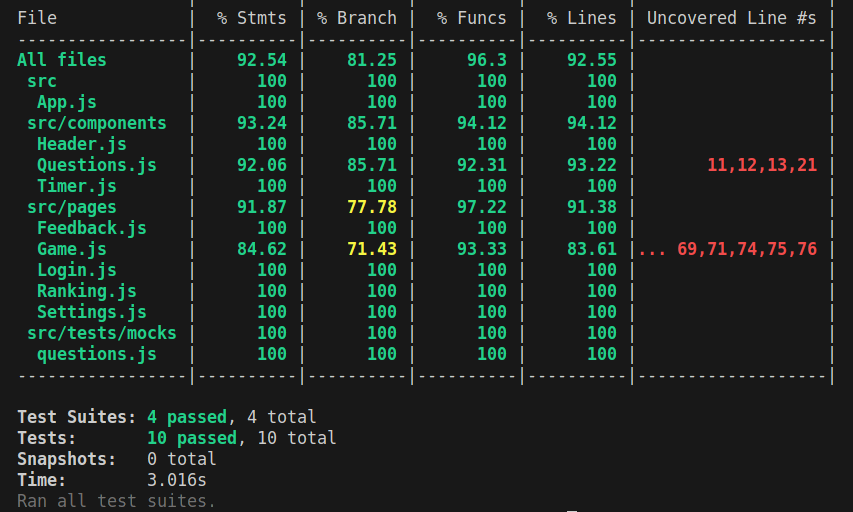

<h1 align="center">Boas-vindas ao repositório do Trivia!</h1>

<h2 align="center">
  <a href="https://h3zord.github.io/trivia" target="_blank">
    Aplicação
  </a>
</h2>
<br/>

## Objetivo

<strong>Trivia</strong> é um jogo de perguntas e respostas no qual o jogador precisa responder corretamente antes que o tempo acabe. Quanto mais rápido a resposta, maior será a pontuação obtida. No final do jogo, é exibida uma tela de pontuação e classificação.

<h2 align="center">Demonstração</h2>
<br/>

<div align="center">

https://user-images.githubusercontent.com/102384026/226149556-88f57a48-14d0-4d7d-9c64-bee87903fa8f.mp4

</div>

<br/>
<br/>

## O que foi desenvolvido?

<strong>Trivia</strong> é um projeto desenvolvido por um grupo de cinco pessoas. Escrevemos o código de forma individual e em pair programming, resultando em um jogo de perguntas e respostas fornecido por uma API.

O planejamento foi realizado por meio de reuniões diárias via Zoom e a comunicação assíncrona foi garantida por meio do Trello e do Slack. Adotamos o Git como nosso método de versionamento de código.

A aplicação foi desenvolvida usando React, Redux para controlar o estado global e CSS para estilização.
Para a construção dos testes, utilizamos as bibliotecas Jest, Mocha e React Testing Library, com desenvolvimento orientado a testes (TDD) e uma cobertura de aproximadamente 80% da aplicação.

Ao iniciar o jogo, o jogador é solicitado a inserir seu nome e e-mail. Em seguida, é direcionado às perguntas, e deve respondê-las antes que o tempo esgote. Quanto mais rápido o jogador responder, mais pontos ele acumulará. São cinco rodadas de perguntas, e ao término, uma tela é renderizada para exibir a pontuação total, permitindo ao jogador jogar novamente ou acessar a área de ranking. Sua pontuação é armazenada no localStorage.

## Linguagens e ferramentas:
- HTML
- CSS
- Javascript
- React
- Redux
- Jest
- Mocha
- React Testing Library

## Instalação e execução

### 1 - Clone o repositório:
```
git clone git@github.com:h3zord/trivia.git
```

### 2 - Entre no repositório:
```
cd trivia
```

### 3 - Instale as dependências:
Caso utilize o npm
```
npm install
```
Caso utilize o yarn
```
yarn install
```

### 4 - Inicie o projeto:
Caso utilize o npm
```
npm start
```
Caso utilize o yarn
```
yarn start
```

## Execução dos testes

### 1 - Rode o script:
Caso utilize o npm
```
npm run test:coverage
```
Caso utilize o yarn
```
yarn test:coverage
```

<h2 align="center">Cobertura de testes</h2>
<br />

<div align="center">
  
</div>
<br />
